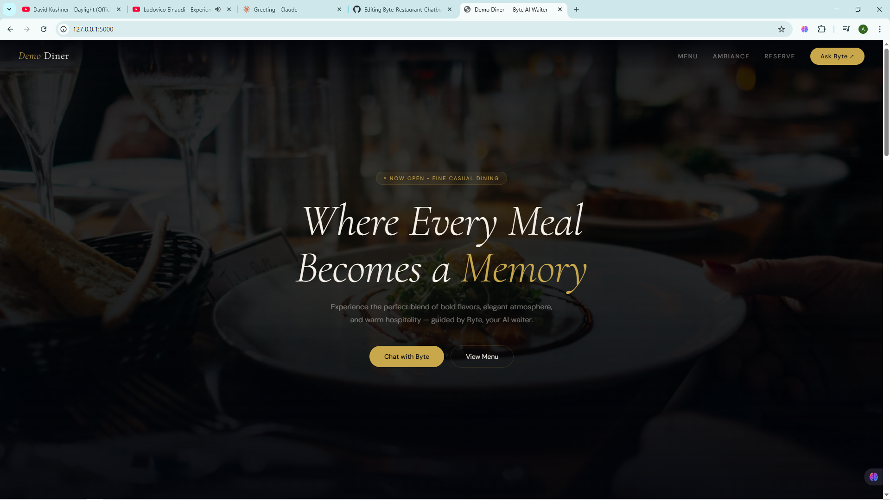
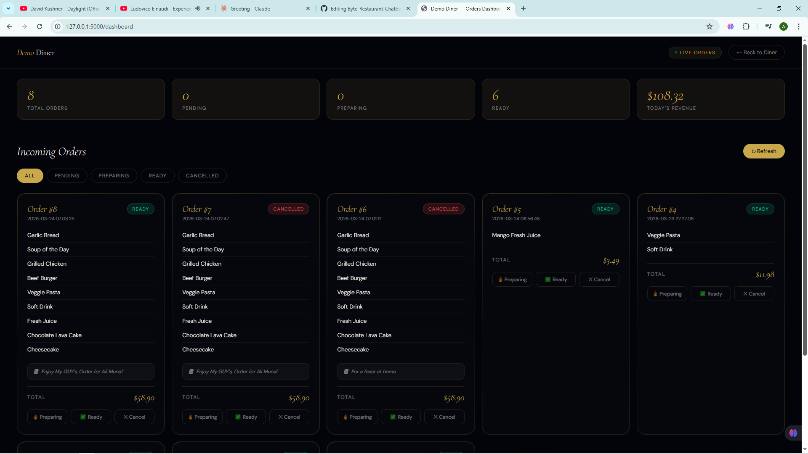

# 🍽️ Byte Restaurant Chatbot  
**Elevate your dining experience with AI-powered hospitality.**  

[](https://github.com/aliii-codes/Byte-Restaurant-Chatbot/stargazers)
[](https://github.com/aliii-codes/Byte-Restaurant-Chatbot/network/members)
[](https://github.com/aliii-codes/Byte-Restaurant-Chatbot/issues)
[](LICENSE)  


  

---

## ✨ What's New in v1.1  
- **🤖 Enhanced Chatbot Intelligence**: Improved context handling for dietary restrictions and special occasions  
- **📊 Real-Time Order Dashboard**: Live order tracking with status updates  
- **🛠️ Robust Error Handling**: Graceful recovery for corrupted data files  

---

| **Feature**               | **Description**                                                                 |
|---------------------------|---------------------------------------------------------------------------------|
| **🍽️ Menu Assistance**     | Provides detailed info on menu items, prices, and ingredients                  |
| **📝 Order Taking**        | Collects and confirms orders with a conversational flow                        |
| **🥗 Dietary Guidance**    | Helps navigate menu options for specific dietary needs                         |
| **📊 Order Management**    | Tracks orders and allows status updates via dashboard/API                      |
| **🧠 Contextual Responses**| Offers thoughtful recommendations and acknowledges special occasions           |

---

## 🚀 Preview  
  
*Byte AI Waiter in action*  

  
*Real-time order management interface*  

---

## 🛠️ Tech Stack  
| Category          | Technologies                                                                 |
|-------------------|------------------------------------------------------------------------------|
| **Backend**       | Python, Flask, Groq (Llama 3.3 70B)                                         |
| **Data Storage**  | JSON (`menu.json`, `orders.json`)                                           |
| **Environment**   | `dotenv`, Python 3.10+                                                      |
| **Frontend**      | HTML/CSS, JavaScript                                                         |

---

## 🛠️ Installation  
1. **Clone the repository**  
   ```bash
   git clone https://github.com/aliii-codes/Byte-Restaurant-Chatbot.git
   cd Byte-Restaurant-Chatbot
   ```

2. **Install dependencies**  
   ```bash
   pip install -r requirements.txt
   ```

3. **Set up environment variables**  
   ```bash
   cp .env.example .env
   # Obtain GROQ_API_KEY from https://console.groq.com
   ```

4. **Run the application**  
   ```bash
   python app.py
   ```

---

## ▶️ Usage  
| **Action**               | **Command/Endpoint**                                                                 |
|--------------------------|--------------------------------------------------------------------------------------|
| **Chat with Byte**       | Access `/` or send POST to `/chat` with JSON body: `{ "message": "...", "history": [...] }` |
| **View Orders**          | Access `/dashboard` or GET `/orders`                                                |
| **Update Order Status**  | POST to `/orders/<order_id>/status` with JSON body: `{ "status": "preparing" }`     |

---

## 📁 Project Structure  
```
Byte-Restaurant-Chatbot/
├── app.py               # Main application logic
├── system.py            # System prompt configuration
├── menu.json            # Menu data
├── orders.json          # Order storage
└── templates/           # HTML templates
    ├── index.html       # Chat interface
    └── dashboard.html   # Order management dashboard
```

---

## 🤝 Contributing  
1. Fork the repository  
2. Create a feature branch: `git checkout -b feature/new-feature`  
3. Commit changes: `git commit -m "Add new feature"`  
4. Push to branch: `git push origin feature/new-feature`  
5. Open a pull request  

---

## 🐞 Bug Reports & Feature Requests  
[Open an issue](https://github.com/aliii-codes/Byte-Restaurant-Chatbot/issues/new/choose)  

---

## 📜 License  
This project is licensed under the [MIT License](LICENSE).  

**Acknowledgements**:  
- Groq for the Llama 3.3 model  
- Open-source contributors for Flask and Python ecosystem libraries
